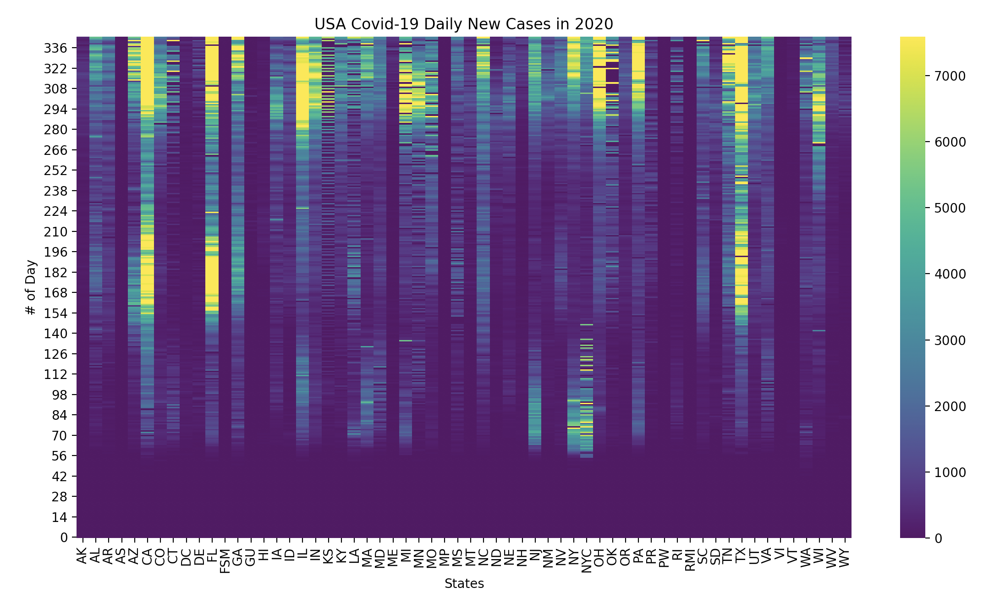
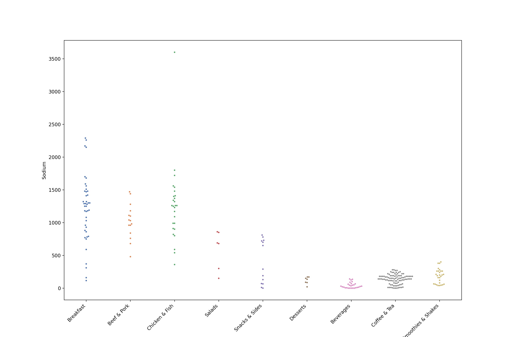
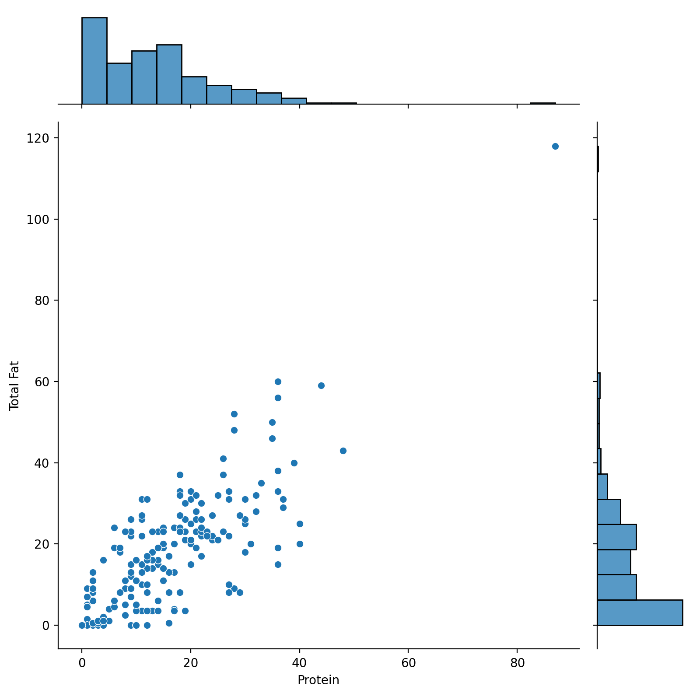
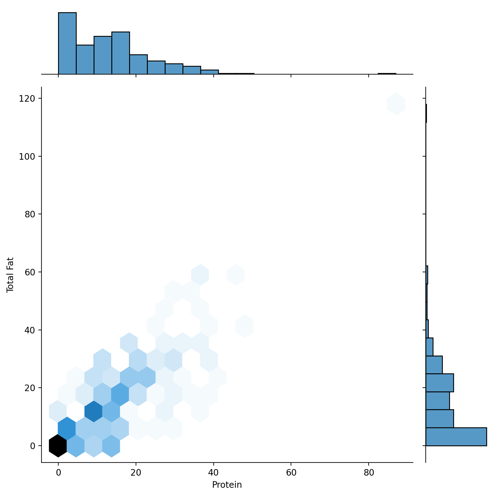
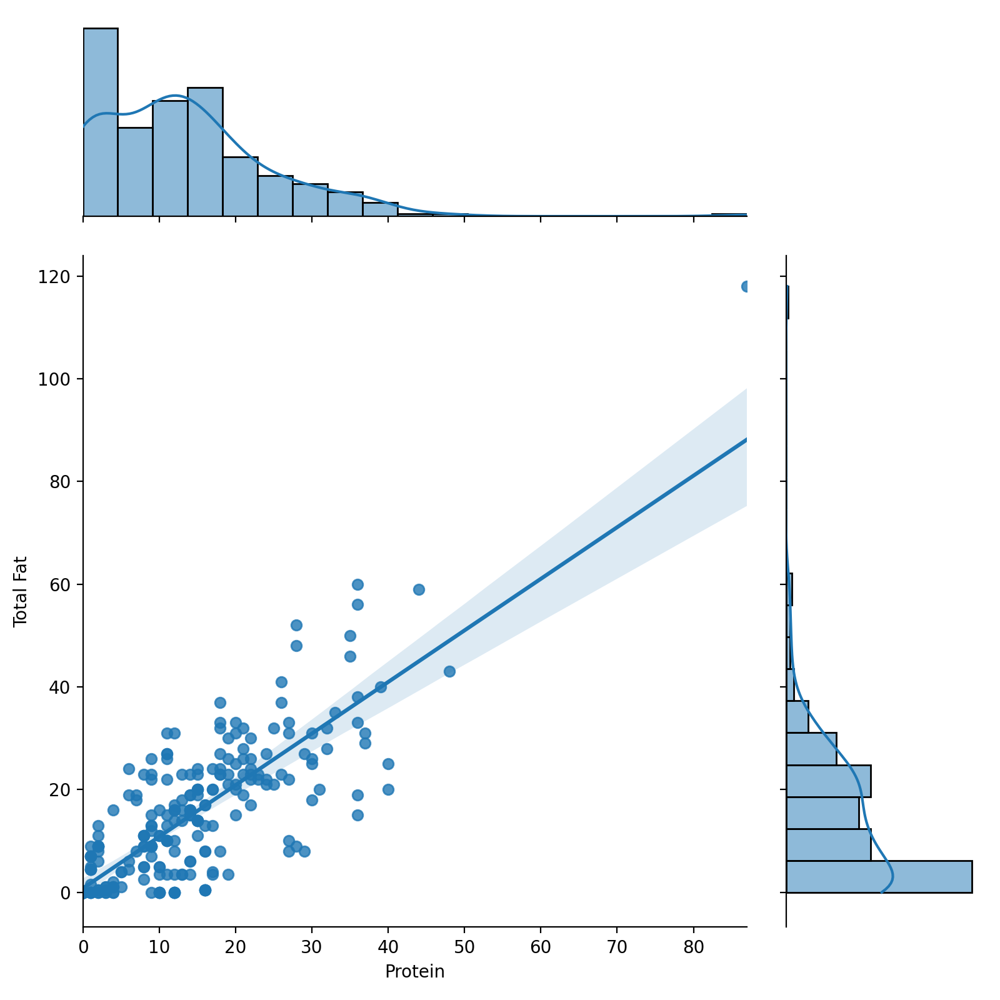
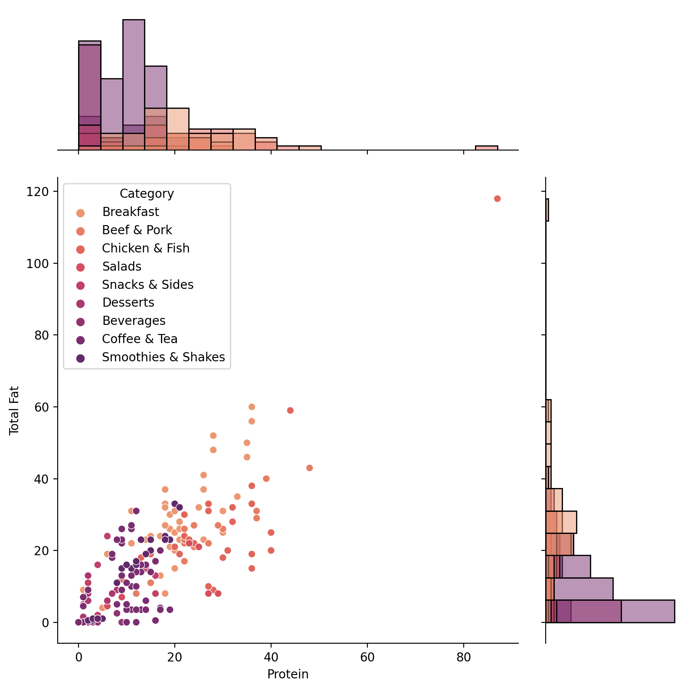
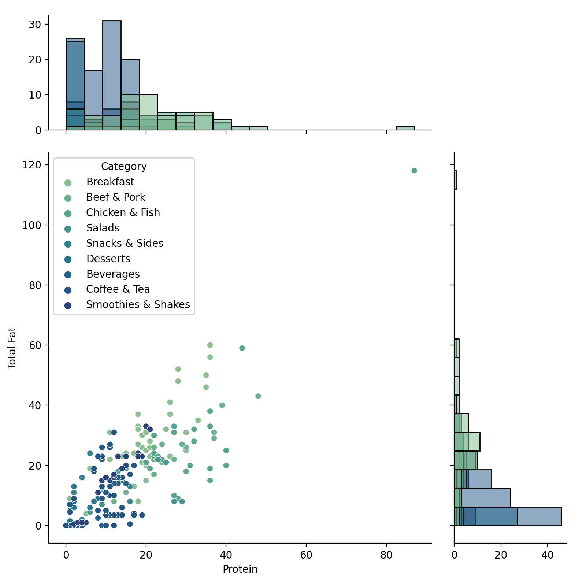
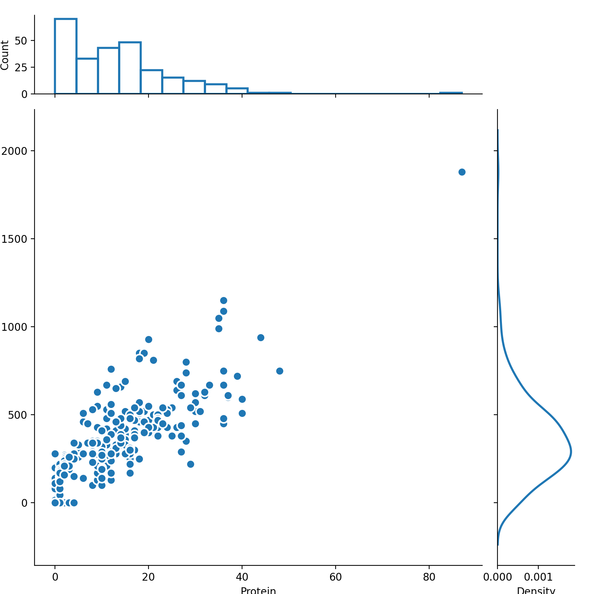
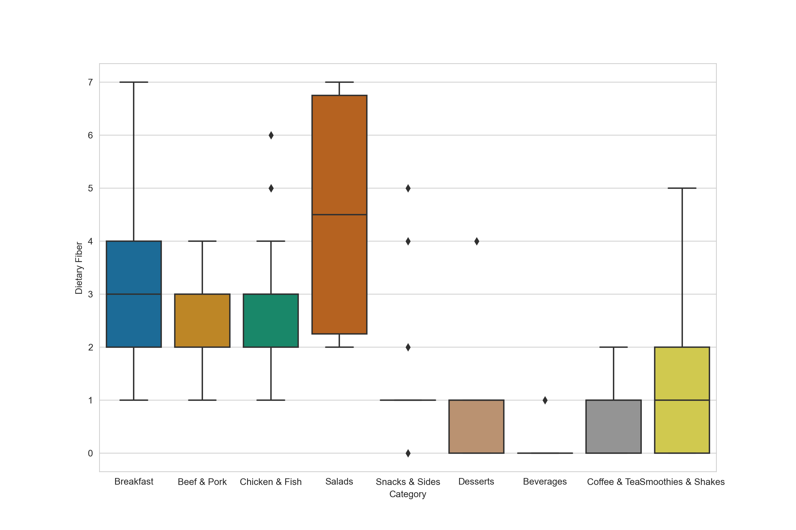

# "Data Data Data!.. You can't make bricks without clay."
    - Sherlock Holmes, The Adventure of the Copper Beeches

This repository showcases data manipulation and plotting techniques. 

# covid_sns_heatmap.py
In the script 'covid_sns_heatmap.py', the raw covid cases dataset is downloaded from data.cdc.gov. 
(Each state submits its data daily since January 22nd, 2020.
At the time of writing, the latest update of the CDC dataset is on December 30th, 2020.)
This plot shows daily new cases in each state using seaborn heatmap.

# ny_mega_millions.py
In the script 'ny_mega_millions.py,' I explored the NY Mega Millions drawn numbers from 2008/01/01 to 2021/01/01. 
The row data is available at https://data.ny.gov/api/views/5xaw-6ayf/rows.csv?accessType=DOWNLOAD.
In class ny_mega_millions, there are three methods:
"top_millions" by default returns five sets of frequently drawn numbers,
"random_millions" by default returns five sets of randomly chosen numbers,
"least_millions" by default returns five sets of least drawn numbers.

After running the script, sample output as follows:
- hot_numbers_combo [[1, 24, 31, 48, 70, 22], [8, 17, 39, 54, 68, 11], [3, 22, 37, 46, 62, 10], [4, 16, 44, 43, 64, 14], [2, 15, 30, 42, 66, 4]]
- random_numbers_combo [[46, 58, 43, 70, 13, 19], [3, 19, 23, 35, 57, 12], [49, 1, 19, 22, 56, 7], [50, 10, 7, 62, 20, 13], [20, 22, 35, 51, 44, 3]]
- cold_numbers_combo [[65, 21, 69, 50, 26, 3], [5, 26, 69, 21, 6, 8], [21, 65, 50, 26, 69, 3], [21, 5, 45, 65, 26, 8], [65, 21, 51, 5, 45, 8]]

# seaborn.plotting.ipynb
Some searborn plotting experiments with data from McDonald's menu nutrients.
#### sodium level within different menu categories

#### sns.jointplot(kind=default) showing correlation between Total Fat and Protein 

#### sns.jointplot(kind='hex') showing correlation between Total Fat and Protein

#### sns.jointplot(kind='reg') showing correlation between Total Fat and Protein

#### sns.jointplot(kind=default, marginal_ticks=False, palette='flare',hue='Category', marginal_ticks=False) showing correlation between Total Fat and Protein

#### sns.jointplot(kind=default,palette="crest", hue='Category', height=8, ratio=3, marginal_ticks=True)

#### more flexibility to plot ax_marg_x and ax_marg_y with different plotting styles; showing correlation between Protein and Calories

#### Boxplot; showing Dietary Fiber in each meal category

