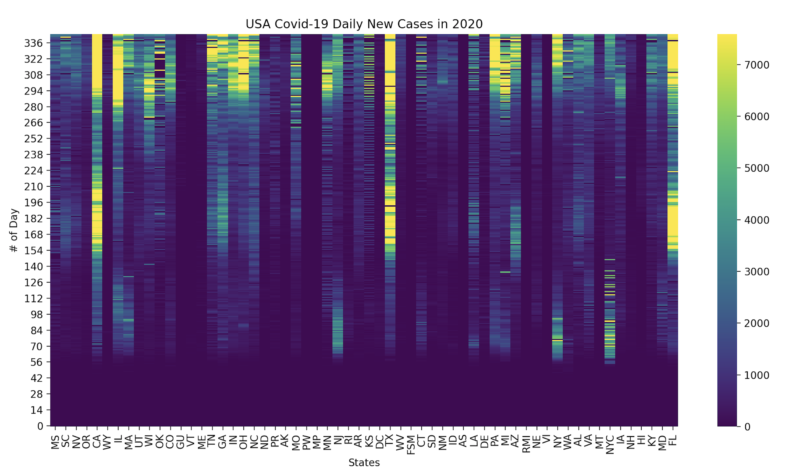

This repository showcases different data plotting techniques. 

In the script 'uas_covid19_heatmap.py', the raw covid cases dataset is downloaded from data.cdc.gov. 
(Each state submits its data daily since January 22nd, 2020.
At the time of writing, the latest update of the CDC dataset is on December 30th, 2020.)
This plot shows daily new cases in each state using searborn heatmap.

